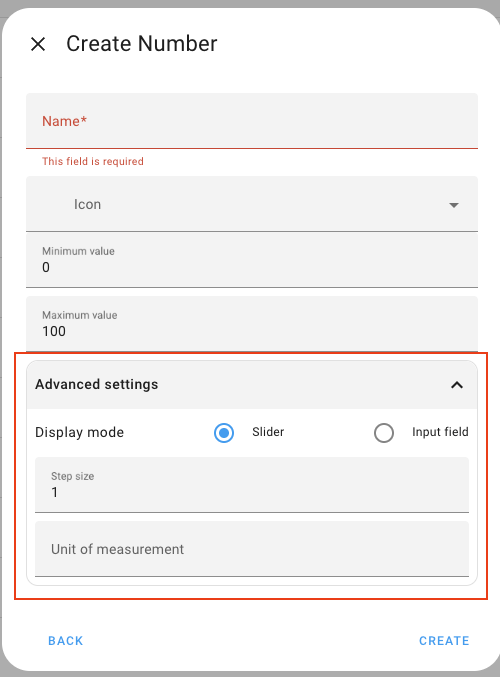

# Home Assistant Entities  🏡


## 🔗 Why is this included?

In case I was ever to forget this rabbit hole!! But this may be useful for similar config in future.

These input numbers were needed for the Energy dashboard when I wanted to set prices dynamically using entities set on another dashboard/page (they are now still used but maintained by the automation making use of the Octopus API, see [Energy-automations.md](../README-energy-automations.md)).

Initially when setting up I couldn't see a way of configuring 

```aiignore
  mode: box
  icon: mdi:currency-gbp
  unit_of_measurement: GBP/kWh
```

through the UI so I added these linked from [configuration.yaml](../configuration.yaml) as 

```aiignore
# Example: How to load custom entities.
#input_number: !include_dir_merge_named entities/input_number
```

It wasn't my preferred route as they then appeared as read only through the UI and required a restart to reload.

It was a few weeks later when adding another **input_number** via _Settings > Devices & services > Helpers_ that I randomly scrolled down and saw the fields! 🤦 (my only excuse being there was no scroll bar on the side to indicate there was more!)

As I add this now I see later versions give a clearly collapsable "Advanced" section, a nice UX improvement!

